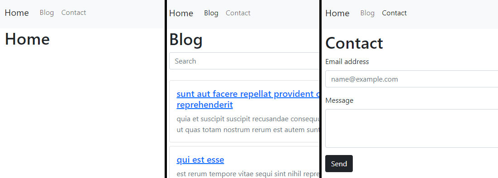
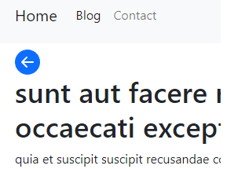
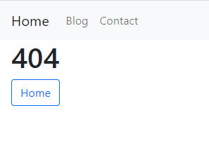

# Mini Blog

This project is a mini blog. It has a home page, blog page with a searcher and a contact page. It was create with [ReactJS](https://reactjs.org/) by the using of hooks.

## Librery

### [Bootstrap 5](https://getbootstrap.com/) and [Bootstrap icons](https://icons.getbootstrap.com/)

Bootstrap was used for the layout of the project. He also used the bootstrap icon "go back" when you are located on a specific blog.

### [React Router Dom](https://v5.reactrouter.com/web/guides/quick-start)

The project has more than one route. This was created with React Router Dom. These routes are `home`, `blog`, `contact`, `post` and `not found`. The first three are accessed from the navigation bar. The post is accessed from the blog page, by clicking on one of them. And the page `not found` appears when none of the above matches the search.

## Hooks

The hooks used were `useState`, `useEffect` and a custom hook called `useFetch`.

### `useFetch`

This hook is used to obtain the data from an API through a fetch request. It also has a state that returns a boolean if the fetch finished loading or not. This is used to make the spinner appear while the request ends. And finally, in case of an error, it is saved in another state.

## Website
You can find this website hosted at: [https://mini-blog-cristiannd.netlify.app/]